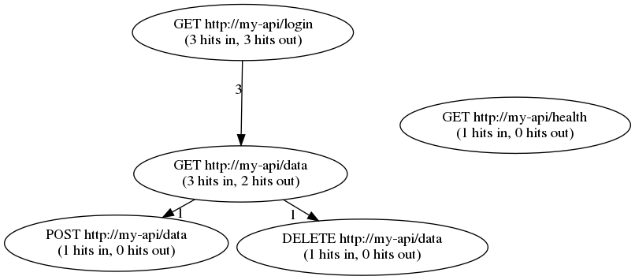

apathy
------

Access log PATH analYzer

STATUS
------

**WORK IN PROGRESS**

OVERVIEW
--------

This tool is used to trace HTTP request paths from access logs,
which can be useful when designing load tests or just figuring out
how other people or systems are using a specific web service.

For example, supposed you had an access log with following lines
in a file named `example.log`:

    2018-12-12T12:00:01.000Z 127.0.0.10:5000 127.0.0.1:80 "GET http://my-api/login" "Mozilla/5.0 USERAGENT 1"
    2018-12-12T12:00:02.000Z 127.0.0.20:5000 127.0.0.1:80 "GET http://my-api/login" "Mozilla/5.0 USERAGENT 2"
    2018-12-12T12:00:03.000Z 127.0.0.10:5000 127.0.0.1:80 "GET http://my-api/data" "Mozilla/5.0 USERAGENT 1"
    2018-12-12T12:00:04.000Z 127.0.0.20:5000 127.0.0.1:80 "GET http://my-api/data" "Mozilla/5.0 USERAGENT 2"
    2018-12-12T12:00:05.000Z 127.0.0.10:5000 127.0.0.1:80 "POST http://my-api/data" "Mozilla/5.0 USERAGENT 1"
    2018-12-12T12:00:06.000Z 127.0.0.20:5000 127.0.0.1:80 "DELETE http://my-api/data" "Mozilla/5.0 USERAGENT 2"
    2018-12-12T12:00:07.000Z 127.0.0.30:5000 127.0.0.1:80 "GET http://my-api/login" "Mozilla/5.0 USERAGENT 3"
    2018-12-12T12:00:08.000Z 127.0.0.30:5000 127.0.0.1:80 "GET http://my-api/data" "Mozilla/5.0 USERAGENT 3"
    2018-12-12T12:00:09.000Z 127.0.0.90:5000 127.0.0.1:80 "GET http://my-api/health" "httpkit"

Running the command below...

    $ apathy -o example.dot example.log

...would produce the following `dot` -formatted file named `example.dot`:

    digraph apathy_graph {
      r0 [label="GET http://my-api/login\n(3 hits in, 3 hits out)"];
      r1 [label="GET http://my-api/data\n(3 hits in, 2 hits out)"];
      r2 [label="POST http://my-api/data\n(1 hits in, 0 hits out)"];
      r3 [label="DELETE http://my-api/data\n(1 hits in, 0 hits out)"];
      r4 [label="GET http://my-api/health\n(1 hits in, 0 hits out)"];
    
      r0 -> r1 [xlabel="3"];
      r1 -> r3 [xlabel="1"];
      r1 -> r2 [xlabel="1"];
    }

Now we can, for example, use the `graphviz` tool to transform it into a PNG image:

    $ sfdp -x -Goverlap=scale -Tpng example.dot -o example.png

From the image we can observe the following facts:

  * `GET http://my-api/login` was called 3 times, and each session
    made another 3 calls after that.
  * `GET http://my-api/data` was called 3 times, but only 2 sessions
    made any other requests after that.
  * `POST http://my-api/data` and `DELETE http://my-api/data` were both called
    only once, and no requests were made after that during any sessions.
  * `GET http://my-api/health` has been called once without a follow-up,
    so it's probably from a monitoring service.

### What is a session?

A session is meant to identify a single user or system during the
lifetime of a log file, consisting of the source IP address and user agent
string by default.

USAGE
-----

The program expects that any log files fed to it contain
at least the following fields:

  * RFC3339-formatted timestamp with millisecond precision.
    - example: `2018-01-01T12:30:00.400`
  * Request field, surrounded by double quotes, with the method and URL inside.
    - example: `"GET https://my-api/v1/data?limit=50 HTTP/1.0"`

Additionally, at least one of the following fields must be present,
in order to identify meaningul session information:

  * Source IPv4 address, with or without a port number.
    - examples: `127.0.0.1:5000` or `10.1.1.50`
  * User agent string, surrounded by double quotes.
    - example: `"Mozilla 5.0 ..."`

TODO
----

  * deterministic multithreading
  * ignore patterns
  * truncate patterns
  * IPv6 source and destination addresses
  * tests
  * non-surrounded request fields
