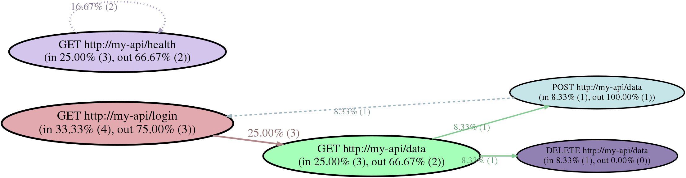

STATUS
------

**WORK IN PROGRESS - EXPECT BUGS**

OVERVIEW
--------

This tool is used to trace HTTP request paths from access logs,
which can be useful when designing load tests or just figuring out
how other people or systems are using a specific web service.

For example, we have the following dummy access log at `examples/simple.log`:

    2018-12-12T12:00:01.000Z 127.0.0.10:5000 "GET http://my-api/login" "Mozilla/5.0 USERAGENT 1"
    2018-12-12T12:00:01.500Z 127.0.0.90:5000 "GET http://my-api/health" "httpkit"
    2018-12-12T12:00:02.000Z 127.0.0.20:5000 "GET http://my-api/login" "Mozilla/5.0 USERAGENT 2"
    2018-12-12T12:00:03.000Z 127.0.0.10:5000 "GET http://my-api/data" "Mozilla/5.0 USERAGENT 1"
    2018-12-12T12:00:04.000Z 127.0.0.20:5000 "GET http://my-api/data" "Mozilla/5.0 USERAGENT 2"
    2018-12-12T12:00:05.000Z 127.0.0.10:5000 "POST http://my-api/data" "Mozilla/5.0 USERAGENT 1"
    2018-12-12T12:00:05.250Z 127.0.0.10:5000 "GET http://my-api/login" "Mozilla/5.0 USERAGENT 1"
    2018-12-12T12:00:05.500Z 127.0.0.90:5000 "GET http://my-api/health" "httpkit"
    2018-12-12T12:00:06.000Z 127.0.0.20:5000 "DELETE http://my-api/data" "Mozilla/5.0 USERAGENT 2"
    2018-12-12T12:00:07.000Z 127.0.0.30:5000 "GET http://my-api/login" "Mozilla/5.0 USERAGENT 3"
    2018-12-12T12:00:08.000Z 127.0.0.30:5000 "GET http://my-api/data" "Mozilla/5.0 USERAGENT 3"
    2018-12-12T12:00:09.000Z 127.0.0.90:5000 "GET http://my-api/health" "httpkit"

Running the command below...

    $ ./apathy -o examples/simple.dot examples/simple.log

...would produce the following `dot` -formatted file in `examples/simple.dot`:

    digraph apathy_graph {
        nodesep=1.0;
        rankdir=LR;
        ranksep=1.0;
    
        subgraph s0 {
            rank = same;
            r0 [label="GET http://my-api/login\n(in 33.33% (4), out 75.00% (3))", fontsize=30, style=filled, fillcolor="#e2aaae", penwidth=4.309401];
            r1 [label="GET http://my-api/health\n(in 25.00% (3), out 66.67% (2))", fontsize=28, style=filled, fillcolor="#d3c5eb", penwidth=4.000000];
        }
    
        subgraph s1 {
            rank = same;
            r2 [label="GET http://my-api/data\n(in 25.00% (3), out 66.67% (2))", fontsize=28, style=filled, fillcolor="#a6ffb9", penwidth=4.000000];
        }
    
        subgraph s2 {
            rank = same;
            r3 [label="POST http://my-api/data\n(in 8.33% (1), out 100.00% (1))", fontsize=22, style=filled, fillcolor="#c6e5e9", penwidth=3.154701];
            r4 [label="DELETE http://my-api/data\n(in 8.33% (1), out 0.00% (0))", fontsize=22, style=filled, fillcolor="#9180b2", penwidth=3.154701];
        }
    
        r0 -> r2 [xlabel="37.50% (3)\n1.7s", fontsize=28, style="solid", color="#b4888b", fontcolor="#876668", penwidth=4.000000];
        r1 -> r1 [xlabel="25.00% (2)\n3.8s", fontsize=25, style="dotted", color="#a89dbc", fontcolor="#7e768d", penwidth=3.632993];
        r2 -> r3 [xlabel="12.50% (1)\n2.0s", fontsize=22, style="solid", color="#84cc94", fontcolor="#63996f", penwidth=3.154701];
        r2 -> r4 [xlabel="12.50% (1)\n2.0s", fontsize=22, style="solid", color="#84cc94", fontcolor="#63996f", penwidth=3.154701];
        r3 -> r0 [xlabel="12.50% (1)\n0.2s", fontsize=22, style="dashed", color="#9eb7ba", fontcolor="#76898b", penwidth=3.154701];
    }

Now we can, for example, use the `dot` tool from `graphviz`
to transform it into a PNG image:

    $ dot -Tpng examples/simple.dot -o examples/simple.png

From the image we can observe at least the following facts:

  * The most common call path is from `GET http://my-api/login` to
    `GET http://my-api/data`, as that edge was taken 3 times.
  * Less common edges are from `GET http://my-api/data` to 
    `POST http://my-api/data` and `DELETE http://my-api/data`,
    and from `POST http://my-api/data` back to `GET http://my-api/login`.
  * `GET http://my-api/health` has been called 3 times, consisting of 2
    repeats, so it's probably from a monitoring service.

Other notes:

  * The more calls an endpoint has, the larger the node.
  * The more hits an edge has, the thicker the line between two nodes.
  * The `in` percentage tells how many of all the requests in the log
    ended up at that node, while the absolute count is in parentheses.
  * The `out` percentage tells how many of the `in` requests continued
    to other nodes, while the absolute count is in parentheses.
  * The edge percentage tells how common that edge is in the whole
    log, with the absolute edge count in parentheses.
  * Below the edge percentage is the average duration for that edge,
    in seconds.
  * Edge lines from a lower depth node to an equal or higher depth node
    are solid, while those from a higher depth node to a lower depth one
    are dashed.
  * Self-referential edge lines are dotted, as seen with the health endpoint.
  * Nodes are grouped by their minimum call depth from left to right,
    so that nodes on the left tend to be the first to be called, while
    those on the right tend to occur deeper during each session.

### How?

The program constructs a *session ID* from each HTTP log entry,
using the user agent and first IPv4 address by default. It uses
this information to construct a call path for each session, after
which we can generate a graph like above.

INSTALL
-------

Compilation is tested only on Linux and OSX at the moment.

### Dependencies

  * Recent GCC or Clang
  * [Concurrency Kit](http://concurrencykit.org/)

### Build

    $ make clean all

USAGE
-----

See `./apathy --help` for command-line reference.

### Log file

#### Date fields

One of two variants below must be found:

  * A single RFC3339-formatted timestamp field, with or without
    millisecond precision
    - examples: `2018-12-12T12:00:01.000Z`, `2018-12-10T18:00:52`
  * Separate date and time fields, where date is in `YYYY-MM-DD` format,
    and time is in `HH:mm:SS` format.
    - example: `2018-12-12    12:00:01`

#### Session fields

One of the two fields below must be found:

  * An IP address field, with or without a port suffix.
    - examples: `127.0.0.1`, `127.0.0.1:5000`
  * A user agent string, enclosed by double quotes if it contains whitespace.
    - example: `"Mozilla/5.0 ..."`

#### Request fields

One of the two variants must be found:

  * A full request field, surrounded by double quotes, with the method and URL inside.
    - example: `"GET https://my-api/v1/data?limit=50 ..."`
  * Separate method, protocol (optional), domain and endpoint fields.
    - examples: `my-api.foo   GET   https   /v1/data`

### Custom field indices

The program tries its best to infer what kind of field lies at each column,
but might find multiple valid matches for a certain field.

For example, the line below:

    2018-12-10  10:00:10    DUB2    615 127.0.0.1   GET foobar.cloudfront.net   /login  200 Mozilla/5.0             id=user1    my-api.foo  https   HTTP/1.1

...has two valid indices for the domain field, being 7 (`foobar.cloudfront.net`)
and 12 (`my-api.foo`). In this case, you probably want to use the field
at index 12, so use the `-i` / `--index` command line option to override
it:

    $ ./apathy --index domain=12 $MY_LOG_FILE

### Truncate patterns

If your log file contains endpoints that take path parameters, such as
UUIDs, then you probably want to combine their occurrences. You may do
this manually with a tool like `sed`,
but you may also use the `-T` / `--truncate-patterns` command line option
to point to a file, that contains the patterns you want to truncate.

For example, using the file at `examples/truncate.txt`:

    # Truncate UUIDs (this line is a comment)
    $UUID = [0-9a-fA-F]{8}\-[0-9a-fA-F]{4}\-[0-9a-fA-F]{4}\-[0-9a-fA-F]{4}\-[0-9a-fA-F]{12}

...would merge the two following requests below:

    GET http://my-api/token/37bd1951-91e0-43ea-a313-ba3074e46ec7/data/131b0ae8-b7df-4d4d-a35c-5b10d1948de3
    GET http://my-api/token/1ccad17e-a51c-4a6b-9f35-d877f2bbd452/data/bcacc232-8173-4cf7-bc12-7591f9f686dd

...into this:

    GET http://my-api/token/$UUID/data/$UUID

TODO
----

  * query parameter session IDs
  * IPv6
  * ignore-patterns
  * JSON output
  * session listing
  * tests
